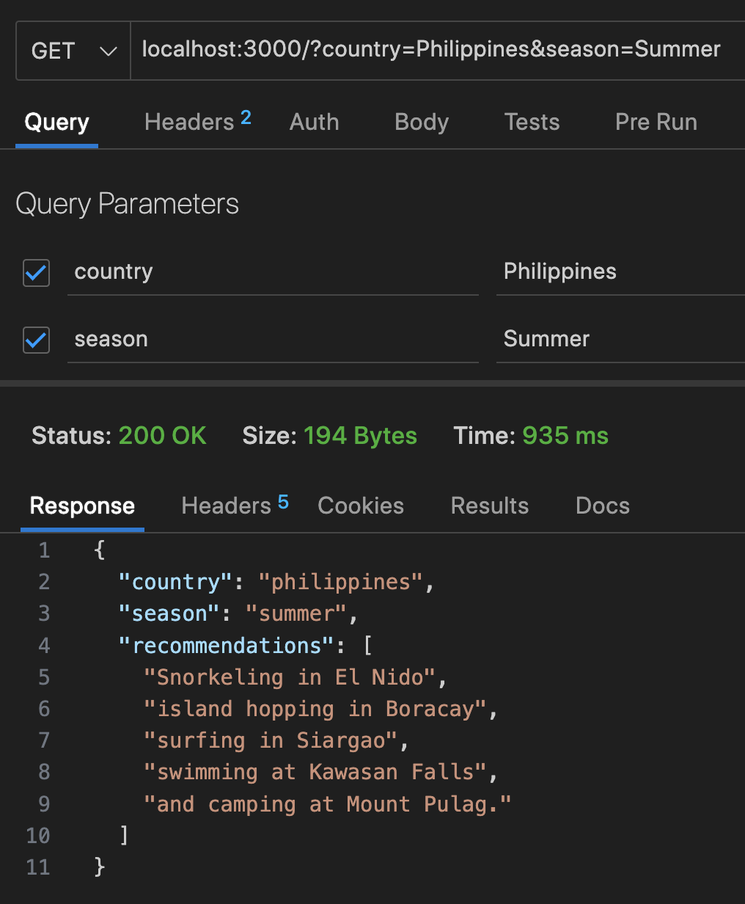
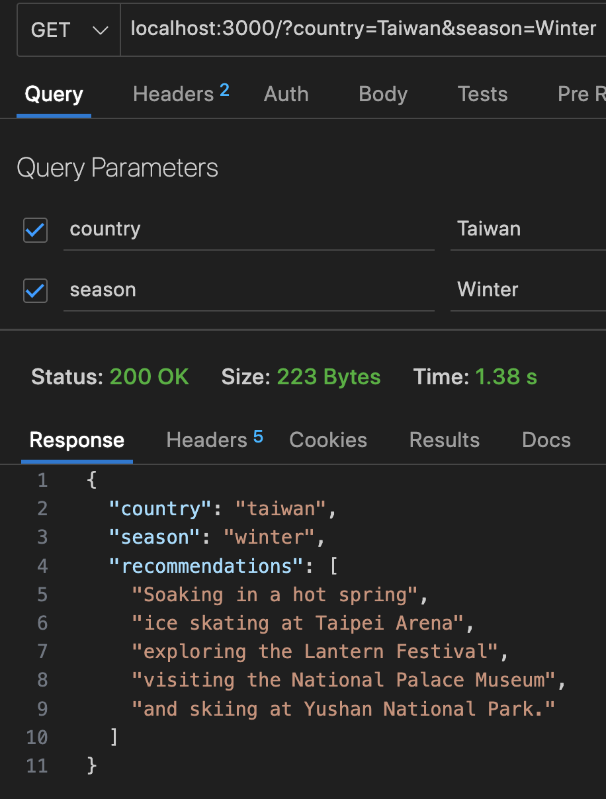
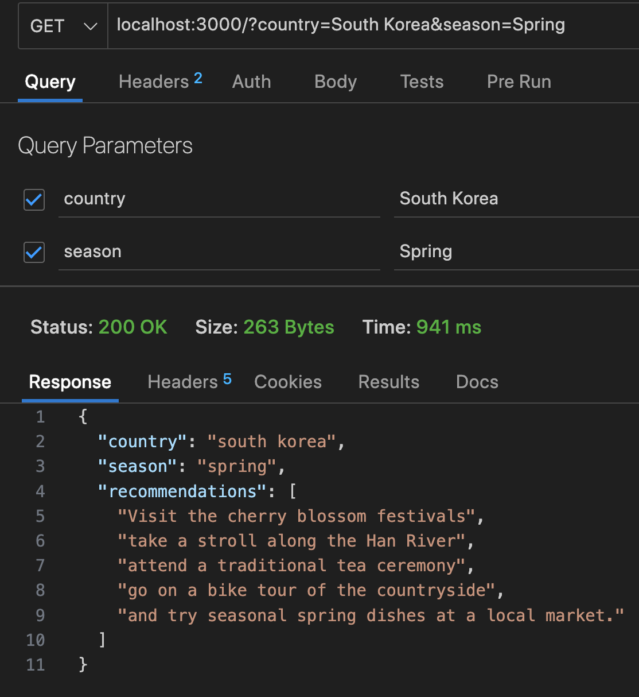
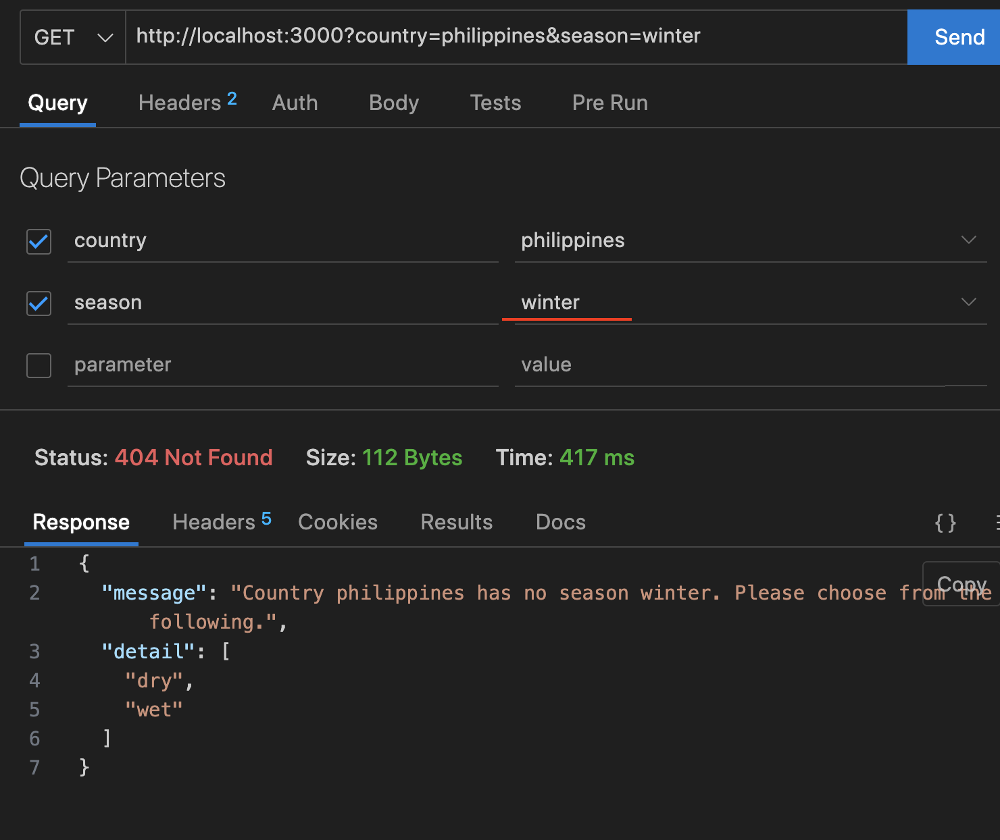
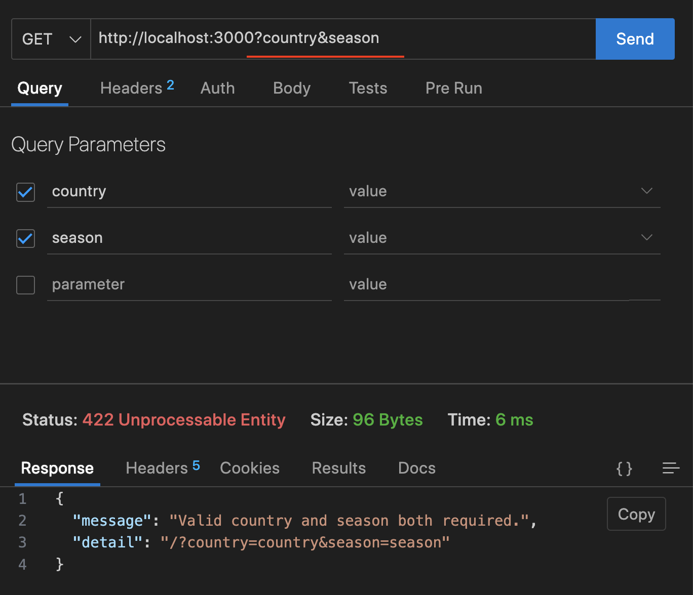
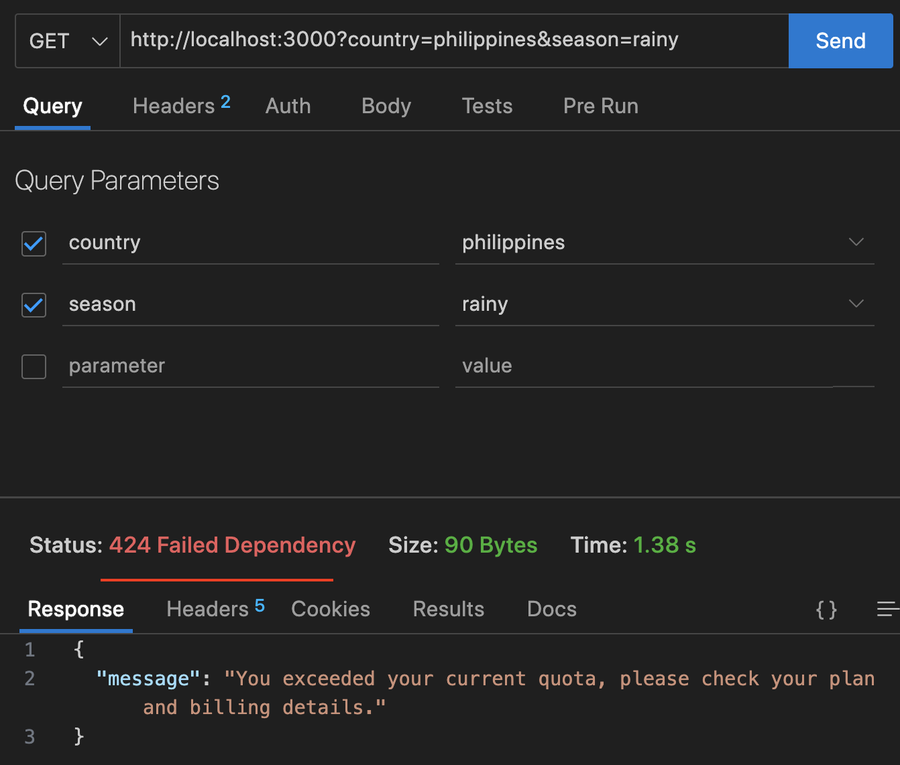

# Overview
AI Powered Activity Recommender based on a given Country and it's Season. Built w/ FastAPI + OpenAI.

# Table of Contents
1. [Setup](#setup)
2. [Usage](#usage)
3. [Demo](#demo)
- [Happy Path](#happy-path)
- [Wrong Season](#wrong-season)
- [No Query Params](#no-query-params)
- [OpenAI API Issue](#openai-api-issue)
4. [Limitations](#limitations)
5. [Improvements](#improvements)

# Setup
1. Clone the repo
```
git clone https://github.com/jrggementiza/activity-recommender.git
```
2. Create an `.env` file and add your OpenAI API Key
```
OPENAI_API_KEY=yOur_OpenAi_ApI_kEy
```

3. Venv Way (Mac)
```
- python3 -m venv venv
- source venv/bin/activate
- pip install -r requirements.txt
- uvicorn main:app --host 0.0.0.0 --port 3000 --reload
```

# Usage
1. Make a `GET` request to the following endpoint:
```
localhost:3000/?country=country&season=season
```
2. Include the `country` and `season` you want as query params


# Demo

## Happy Paths
### Philippine Summer

### Taiwan Winter

### South Korea Spring


## Wrong Season


## No Query Params


## OpenAI API Issue


# Limitations
- This is prone to hiccups and hallucinations as w/ any AI powered apps as opposed to a Programatic / ML Derived recommender.
- ~~An example to this is the recommendations might not make sense given the season at times.~~
- ~~Additionally, deriving seasons of a country via AI is not as idempotent as say determining a country's seasons based on if they are tropical, temperate, and so on.~~
- Above issues can be mitigated by further fine tuning.


# Improvements
- :white_check_mark: ~~Determine Seasons of a Country Programmatically instead of via AI~~
- :white_check_mark: ~~Prompt Improvement~~ and Token Minimization
- Throttle
- Persist Data of repeat requests to minimize OpenAI API Calls

---
[Back To Top](#table-of-contents)